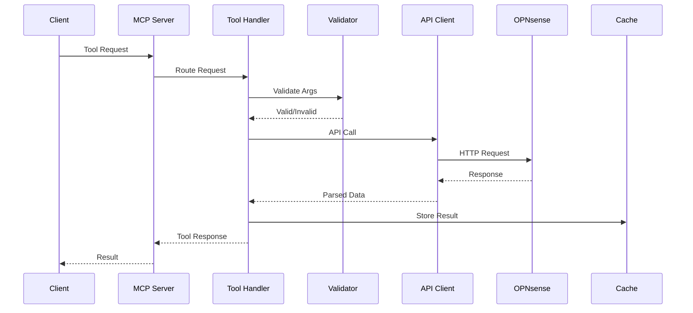
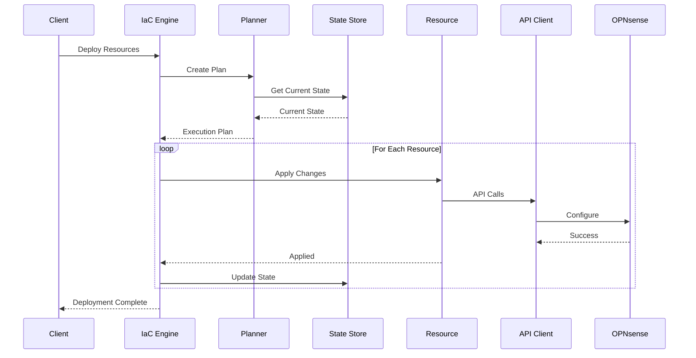

# OPNSense MCP Server - Architecture Documentation

## 🏗️ System Overview

The OPNSense MCP Server is a Model Context Protocol (MCP) implementation that provides programmatic access to OPNsense firewall management. It bridges the gap between AI assistants and network infrastructure management through a standardized protocol.

### Core Capabilities
- **Firewall Management**: Rules, aliases, NAT configuration
- **Network Configuration**: VLANs, interfaces, routing
- **Service Management**: DHCP, DNS, HAProxy load balancing
- **Infrastructure as Code**: Declarative resource management
- **Backup & Recovery**: Configuration snapshots and restoration
- **Macro Recording**: Capture and replay operation sequences

## 📐 Architecture Layers

```
┌─────────────────────────────────────────────────────┐
│                   MCP Client Layer                   │
│         (Claude, VS Code, Custom Clients)            │
└─────────────────────────────────────────────────────┘
                            │
                    ┌───────▼────────┐
                    │  MCP Protocol   │
                    │   (JSON-RPC)    │
                    └───────┬────────┘
                            │
┌─────────────────────────────────────────────────────┐
│                  Transport Layer                     │
│   ┌──────────────┐              ┌──────────────┐   │
│   │    STDIO     │              │     SSE      │   │
│   │  Transport   │              │  Transport   │   │
│   └──────────────┘              └──────────────┘   │
└─────────────────────────────────────────────────────┘
                            │
┌─────────────────────────────────────────────────────┐
│                    Server Core                       │
│   ┌──────────────────────────────────────────┐     │
│   │            Request Router                 │     │
│   └──────────────────────────────────────────┘     │
│   ┌──────────────┐  ┌────────────────────────┐    │
│   │ Tool Handler │  │  Resource Handler      │     │
│   └──────────────┘  └────────────────────────┘    │
└─────────────────────────────────────────────────────┘
                            │
┌─────────────────────────────────────────────────────┐
│                  Business Logic                      │
│   ┌───────────┐  ┌──────────┐  ┌─────────────┐   │
│   │ Resources │  │   IaC    │  │   Macros    │   │
│   │  (CRUD)   │  │  Engine  │  │  Recorder   │   │
│   └───────────┘  └──────────┘  └─────────────┘   │
└─────────────────────────────────────────────────────┘
                            │
┌─────────────────────────────────────────────────────┐
│                   Service Layer                      │
│   ┌───────────┐  ┌──────────┐  ┌─────────────┐   │
│   │   Cache   │  │  State   │  │   Backup    │   │
│   │  Manager  │  │  Store   │  │   Manager   │   │
│   └───────────┘  └──────────┘  └─────────────┘   │
└─────────────────────────────────────────────────────┘
                            │
┌─────────────────────────────────────────────────────┐
│                    API Layer                         │
│   ┌────────────────────────────────────────────┐   │
│   │         OPNSense API Client                │   │
│   │   (Authentication, Request/Response)       │   │
│   └────────────────────────────────────────────┘   │
└─────────────────────────────────────────────────────┘
                            │
                    ┌───────▼────────┐
                    │   OPNsense     │
                    │   Firewall     │
                    └────────────────┘
```

## 🔧 Component Architecture

### 1. Transport Layer
Handles communication between MCP clients and the server.

```typescript
TransportManager
├── StdioServerTransport    // CLI-based communication
└── SSETransportServer       // HTTP/SSE for web clients
    └── Express Server       // HTTP endpoint management
```

**Key Features:**
- Multi-transport support (STDIO, SSE)
- Automatic transport selection based on environment
- Connection lifecycle management
- Error recovery and reconnection

### 2. Server Core
Central request processing and routing.

```typescript
OPNSenseMCPServer
├── Request Router
│   ├── Tool Requests      → Tool Handlers
│   ├── Resource Requests  → Resource Handlers
│   └── System Requests    → System Handlers
├── Tool Registry
│   ├── VLAN Tools
│   ├── Firewall Tools
│   ├── Service Tools
│   └── IaC Tools
└── Resource Registry
    ├── Static Resources
    └── Dynamic Resources
```

### 3. Resource Management
CRUD operations for OPNsense entities.

```typescript
Resources/
├── Network/
│   ├── VlanResource        // VLAN management
│   ├── ArpTableResource    // ARP table operations
│   └── InterfaceResource   // Network interfaces
├── Firewall/
│   ├── FirewallRuleResource // Rule management
│   └── AliasResource       // Alias management
├── Services/
│   ├── DhcpLeaseResource   // DHCP leases
│   ├── DnsBlocklistResource // DNS filtering
│   └── HAProxyResource     // Load balancer config
└── Base Classes/
    ├── IaCResource         // IaC base functionality
    └── BaseResource        // Common resource patterns
```

### 4. Infrastructure as Code (IaC)
Declarative resource management system.

```typescript
IaC System/
├── ResourceRegistry        // Type registration
├── DeploymentPlanner       // Dependency resolution
├── ExecutionEngine         // Apply/destroy operations
└── ResourceStateStore      // State persistence
    ├── Current State
    ├── Desired State
    └── State Diff
```

**Workflow:**
1. Parse resource definitions
2. Build dependency graph
3. Plan execution order
4. Execute changes
5. Update state
6. Verify convergence

### 5. Caching System
Performance optimization through intelligent caching.

```typescript
CacheManager/
├── EnhancedCacheManager    // Advanced features
│   ├── TTL Management
│   ├── Size Limits
│   ├── Compression (TODO)
│   └── Statistics
└── MCPCacheManager         // Basic caching
    ├── In-memory Store
    └── Invalidation Rules
```

**Cache Strategies:**
- API response caching (5-minute TTL)
- Resource state caching
- Macro execution caching
- Lazy invalidation on writes

### 6. State Management
Persistent state for IaC and system configuration.

```typescript
StateStore/
├── File-based Persistence
├── Encryption (TODO)
├── Versioning
└── Migration Support
```

### 7. API Client
OPNsense API communication layer.

```typescript
OPNSenseAPIClient/
├── Authentication
│   ├── API Key/Secret
│   └── Session Management
├── Request Builder
│   ├── URL Construction
│   ├── Parameter Encoding
│   └── Header Management
└── Response Handler
    ├── Error Detection
    ├── Data Transformation
    └── Retry Logic
```

## 🔄 Data Flow

### Tool Execution Flow


### IaC Deployment Flow


## 🗂️ Directory Structure

```
src/
├── api/                    # API client implementation
│   ├── client.ts          # Main API client
│   └── auth.ts            # Authentication logic
├── cache/                  # Caching implementations
│   ├── manager.ts         # Basic cache
│   └── enhanced-manager.ts # Advanced features
├── db/                     # Database operations
│   └── network-query/     # Network data queries
├── deployment/             # IaC deployment
│   └── planner.ts         # Deployment planning
├── execution/              # IaC execution
│   └── engine.ts          # Execution engine
├── macro/                  # Macro system
│   ├── recorder.ts        # Operation recording
│   ├── generator.ts       # Code generation
│   └── analyzer.ts        # Macro analysis
├── resources/              # Resource implementations
│   ├── base.ts            # Base classes
│   ├── network/           # Network resources
│   ├── firewall/          # Firewall resources
│   ├── services/          # Service resources
│   └── registry.ts        # Resource registry
├── state/                  # State management
│   └── store.ts           # State persistence
├── tools/                  # MCP tool definitions
│   ├── vlan.ts            # VLAN tools
│   ├── firewall.ts        # Firewall tools
│   └── iac.ts             # IaC tools
├── transports/             # Transport implementations
│   ├── SSETransportServer.ts
│   └── TransportManager.ts
├── utils/                  # Utilities
│   ├── logger.ts          # Logging
│   └── validation.ts      # Input validation
└── index.ts               # Main entry point
```

## 🔐 Security Architecture

### Authentication Flow
```
Client → MCP Server → API Client → OPNsense
         (MCP Auth)   (API Keys)   (HTTPS)
```

### Security Layers
1. **Transport Security**: TLS/SSL for API communication
2. **Authentication**: API key/secret pairs
3. **Authorization**: Role-based permissions in OPNsense
4. **Input Validation**: Zod schemas for all inputs
5. **State Protection**: Encryption for sensitive data (planned)
6. **Audit Logging**: All operations logged with context

## 🚀 Deployment Architecture

### Standalone Deployment
```
┌─────────────┐
│   Client    │
└──────┬──────┘
       │ STDIO
┌──────▼──────┐
│ MCP Server  │
└──────┬──────┘
       │ HTTPS
┌──────▼──────┐
│  OPNsense   │
└─────────────┘
```

### Container Deployment
```
┌─────────────┐
│   Client    │
└──────┬──────┘
       │ HTTP/SSE
┌──────▼──────┐
│   Docker    │
│ ┌─────────┐ │
│ │   MCP   │ │
│ │ Server  │ │
│ └─────────┘ │
└──────┬──────┘
       │ HTTPS
┌──────▼──────┐
│  OPNsense   │
└─────────────┘
```

### High Availability Setup
```
        ┌──────────┐
        │ Load     │
        │ Balancer │
        └────┬─────┘
             │
    ┌────────┴────────┐
    │                 │
┌───▼───┐        ┌───▼───┐
│ MCP   │        │ MCP   │
│ Node1 │        │ Node2 │
└───┬───┘        └───┬───┘
    │                 │
    └────────┬────────┘
             │
      ┌──────▼──────┐
      │  OPNsense   │
      │   Cluster   │
      └─────────────┘
```

## 🎯 Design Patterns

### 1. Repository Pattern
Resources act as repositories for domain entities.
```typescript
class VlanResource {
  async list(): Promise<Vlan[]>
  async get(id: string): Promise<Vlan>
  async create(data: VlanInput): Promise<Vlan>
  async update(id: string, data: Partial<Vlan>): Promise<Vlan>
  async delete(id: string): Promise<void>
}
```

### 2. Strategy Pattern
Different caching strategies for different data types.
```typescript
interface CacheStrategy {
  shouldCache(key: string): boolean
  getTTL(key: string): number
  invalidate(pattern: string): void
}
```

### 3. Command Pattern
Macro recording captures operations as commands.
```typescript
interface Command {
  execute(): Promise<Result>
  undo(): Promise<void>
  serialize(): object
}
```

### 4. Factory Pattern
Resource registry creates resources dynamically.
```typescript
class ResourceRegistry {
  register(type: string, factory: ResourceFactory): void
  create(type: string, props: any): Resource
}
```

## 📊 Performance Considerations

### Optimization Strategies
1. **Connection Pooling**: Reuse API connections
2. **Request Batching**: Combine multiple API calls
3. **Caching**: Multi-level cache hierarchy
4. **Lazy Loading**: Load resources on demand
5. **Compression**: Compress large payloads (planned)

### Bottlenecks & Solutions
| Bottleneck | Current Solution | Future Improvement |
|------------|-----------------|-------------------|
| API Rate Limits | Request throttling | Request batching |
| Large State Files | File-based storage | Database backend |
| Memory Usage | TTL-based eviction | LRU cache |
| Network Latency | Response caching | Edge deployment |

## 🔄 Extension Points

### Adding New Resources
1. Create resource class extending `IaCResource`
2. Define Zod schema for validation
3. Implement `toAPIPayload()` and `fromAPIResponse()`
4. Register in resource registry
5. Add corresponding MCP tools

### Adding New Transports
1. Implement Transport interface
2. Handle connection lifecycle
3. Register in TransportManager
4. Configure in environment variables

### Adding New Cache Strategies
1. Implement CacheStrategy interface
2. Define TTL and invalidation rules
3. Register in CacheManager
4. Configure via settings

## 🚦 Future Architecture Enhancements

### Planned Improvements
1. **Event-Driven Architecture**: WebSocket subscriptions for real-time updates
2. **Plugin System**: Dynamic loading of custom resources
3. **Distributed State**: Redis/etcd for shared state
4. **GraphQL API**: Alternative query interface
5. **Observability**: OpenTelemetry integration
6. **Multi-tenancy**: Isolated resource namespaces

---

*This architecture document provides a comprehensive overview of the OPNSense MCP Server's design, components, and patterns.*